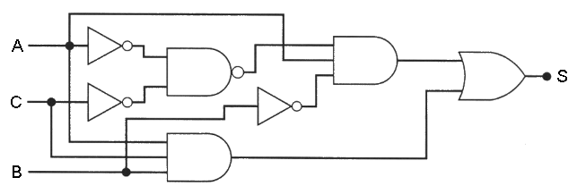
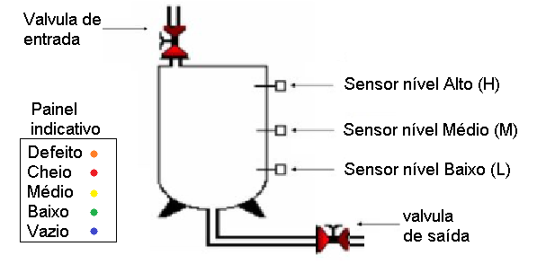
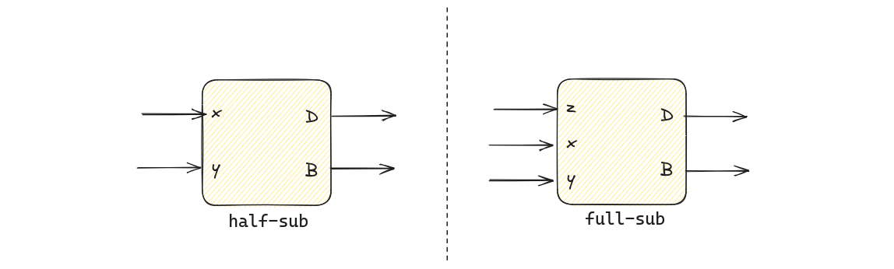

# AV2 - bits e proc

1. Prática (github)

Você possui um total de 1h20 para realizar a avaliação, você pode decidir
como usar o seu tempo.

- **NÃO PODE USAR O GITHUB COPILOT**
- **Trabalhar sozinho**
- **1h20 min**
- **REALIZAR UM COMMIT (A CADA QUESTÃO) E DAR PUSH AO FINALIZAR**

## Começando

Você deve:

1. Usar o codespace na prova
1. não esqueça de dar `commit` e `push` a cada questão

Lembre de executar uma única vez `telemetry auth` no codespace.

> Todas as questões possuem testes, para executar: `pytest -s -k QUESTAO`

Você deve realizar as implementações no arquivo: 

- `coponentes.py`

## Questão 1

| Módulo             | pnts   |
| ------------------ | ------ |
| `exe1(a,b,c,s)`    | 2 (HW) |

Implemente o circuito a seguir em MyHDL



Considere:

```python
- a,b,c : Entradas do tipo bool()
- s: Saída do tipo bool()
```

## Questão 2

| Módulo                                                                       | pnts   |
|------------------------------------------------------------------------------|--------|
| `exe2(L, M, H, LED_verde, LED_amarelo, LED_vermelho, LED_azul, LED_laranja)` | 2 (HW) |

Você é encarregado de desenvolver um sistema de detecção de nível de líquido inflamável em um tanque de uma industria química. O tanque possui três sensores de nível: Baixo (L), Médio (M) e Alto (H). Cada sensor produz um sinal lógico ALTO quando o nível do líquido atinge sua posição.

Você deve desenvolver um circuito em MyHDL que acenda LEDs indicativos com base nas seguintes condições:

1. Se o sensor de nível Baixo (L) estiver ativo e os outros dois sensores estiverem inativos, um `LED verde` deve acender, indicando que o tanque está no nível baixo.
2. Se os sensores de nível Baixo (L) e Médio (M) estiverem ativos, e o sensor Alto (H) estiver inativo, um `LED amarelo` deve acender, indicando que o tanque está no nível médio.
3. Se todos os três sensores estiverem ativos, um `LED vermelho` deve acender, indicando que o tanque está cheio.
4. Se nenhum sensor estiver ativo, `um LED azul` deve acender, indicando que o tanque está vazio.
5. Se sensor Alto (H) estiver ativo e pelo menos um dos outros dois sensores estiver inativo ou se o sensor Médio (M) estiver ativo e o sensor Baixo (L) inativo, um `LED laranja` deve acender, indicando que existe alguma falha nos sensores.



Considere:

```python
- L,M,H : Entradas do tipo bool()
- LED_verde, LED_amarelo, LED_vermelho, LED_azul, LED_laranja: Saídas do tipo bool()
```

## Questão 3

| Arquivo               | pnts |
| --------------------- | ---- |
| (a) Diagrama no papel | 6    |
| (b) Explicação        | 2    |

Considere o componente a seguir:

```python


```

- Considere as entradas e saídas do componentes como sendo do tipo `bool()`.

### (a)

> No papel

No papel faca o diagrama de blocos do componente.

### (b)

> No papel

Explique em um parágrafo o que o componente faz.

## Questão 3

| Arquivo                | pnts   |
| ---------------------- | ------ |
| (a) Resolução no papel | 4 (HW) |
| (b) `exe3(x, y, z)`    | 2 (HW) |

Você deve desenvolver um componente que calcula a paridade par (`p`) de um vetor de três bits (`x2`, `x1`, `x0`). A paridade de um vetor é um bit a mais que torna a soma de todos os bits do vetor positivo (se fosse paridade ímpar, torna a soma um valor ímpar.):

` SUM(x2, x1, x0, p) = par`

Exemplos:

- `x=100` -> `p=1` (`1+0+0+1 = 2 (par)`)
- `x=110` -> `p=0` (`1+1+0+0 = 2 (par)`)

O bit de paridade é muito utilizado em protocolos de comunicacão como uma das maneiras de se detectar erro durante o envio de um pacote, junto com o dado enviasse a paridade e se ela não bater quer dizer que algo deu errado. O problema da paridade é que ela não pega erro em 2 bits.

### (a)

> No papel

Encontre a equação que controla o sinal de paridade `p` dado uma entrada de três bits `x`.

### (b)

Implemente em MyHDL a solução para o módulo que calcula paridade.

- Testar com: `pytest -k exe3 -s`

Saiba que:

- `x2`, `x1`, `x0`: São entradas do tipo `bool()`
- `p`: Saída do tipo `bool()`

## Questão 4

| Arquivo    | pnts    |
| ---------- | ------- |
| (a) `add3` | 4 (HW)  |
| (b) Simulação | 4 (HW)  |
| (c) `exe4` | 6 (HW) |

De forma similar ao `half-adder` e `full-adder`, podemos desenvolver dois componentes chamados de `half-subtractor` e `full-subtractor` que realizam a subtração de números binários.



O `half-subtractor` é um circuito combinacional que subtrai dois bits (`x`, `y`), gerando dois tipos de saída: a diferença (`D`) e o borrow (`B`). O borrow é a saída que indica se foi necessário "emprestar" um bit do próximo dígito mais significativo para realizar a subtração.

O `full-subtractor`, por sua vez, é uma extensão do `half-subtractor`, sendo utilizado para subtrair três bits de entrada: dois bits que são subtraídos (`x`, `y`) e um bit de borrow da subtração anterior (`z`). Assim como o `half-subtractor`, o `full-subtractor` tem duas saídas: a diferença (`D`) e o borrow (`B`).

Ambos, `half-subtractor` e `full-subtractor`, são usados para a construção de unidades aritméticas em sistemas digitais, possibilitando a realização de operações de subtração em números binários de múltiplos bits (sem a necessidade de realizamor uma sucessão de somas e deslocamentos, que é algo lento).

Considere a tabela verdade dos dois componentes:

- `half-subtractor`

| x | y | B | D |
|---|---|---|---|
| 0 | 0 | 0 | 0 |
| 0 | 1 | 1 | 1 |
| 1 | 0 | 0 | 1 |
| 1 | 1 | 0 | 0 |

- `full-subtractor`

| x | y | z | B | D |
| 0 | 0 | 0 | 0 | 0 |
| 0 | 0 | 1 | 1 | 1 |
| 0 | 1 | 0 | 1 | 1 |
| 0 | 1 | 1 | 1 | 0 |
| 1 | 0 | 0 | 0 | 1 |
| 1 | 0 | 1 | 0 | 0 |
| 1 | 1 | 0 | 0 | 0 |
| 1 | 1 | 1 | 1 | 1 |

### Circuito 

No papel desenhe um diagrama que usando os dois componentes implemente um subtrator que recebe como entrada dois vetores: `V` e `P` de trés bits cada (`[V2 V1 V0]`, `[P2 P1 P0]`) e gere um terceiro vetor também de três bits `Q` (`[Q2 Q1 Q0]`) que é resultado de: `Q = V - P`.

### `add3`


### `Simulando`

<!-- 
> No papel

Vamos simular se a proposta de hardware converte corretamente um número binário para BCD? Para isso iremos simular uma entrada em binário do número **45** e devemos obter o BCD correto relativo a este valor.

-->

### Double dabble

Implemente o Double dabble em myhdl, usando três componente `add3`.

Note os tipos dos sinais:

```python
    b = Signal(modbv(0)[6:])
    p = Signal(modbv(0)[8:])
```
