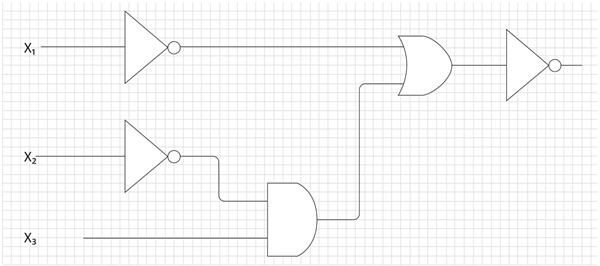
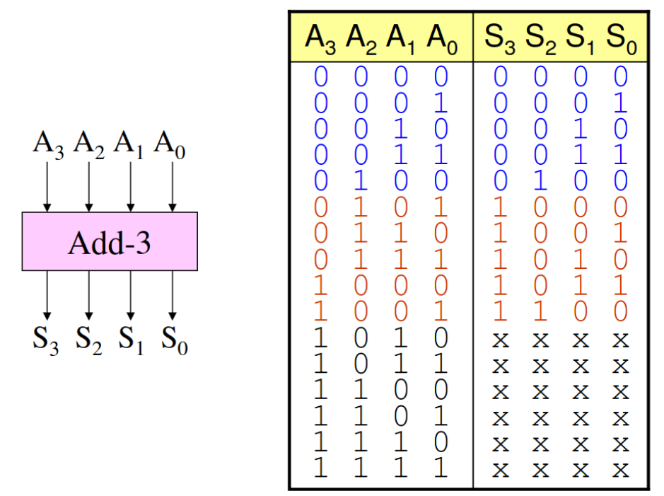

# AV2 - bits e proc

1. Prática (github)

Você possui um total de 1h20 para realizar a avaliação, você pode decidir
como usar o seu tempo.

- **NÃO PODE USAR O GITHUB COPILOT**
- **Trabalhar sozinho**
- **1h20 min**
- **REALIZAR UM COMMIT (A CADA QUESTÃO) E DAR PUSH AO FINALIZAR**

## Começando

Você deve:

1. clonar o repositório que foi gerado pelo link (e trabalhar nele)
1. editar o arquivo `ALUNO.yml`
1. não esqueça de dar `commit` e `push` a cada questão

> Todas as questões possuem testes, para executar: `pytest -k QUESTAO`

Lembre de gerar um ambiente virtual:

```bash
python -m venv env
pip3 install -r requirements.txt
. env/bin/activate
```

### Questão 1

| Módulo             | pnts   |
| ------------------ | ------ |
| Resolução no papel | 4 (HW) |
| `exe1(a,b,c,q)`    | 2 (HW) |

- **O teste apenas verifica se o Myhdl está correto, ele não testa o módulo! passar no teste não indica que está certo!!**

Em 1938, o matemático americano Claude Shannon notou o paralelismo entre a lógica proposicional e a lógica dos circuitos e percebeu que a álgebra booleana teria um papel importante na sistematização deste ramo da eletrônica. Cada um dos conetivos básicos da lógica são instâncias das operações básicas da álgebra booleana (“+”, “.” e ” ’ ”). Expressões booleanas combinando operações e variáveis podem ser usadas para representar circuitos combinacionais formados por portas lógicas.
GERSTING, J. L. Mathematical Structures for Computer Science.
New York: W. H. Freeman and Company, 2002.

A partir das informações apresentadas, considere o circuito combinacional da figura a seguir.



Descreva a equação do circuito anterior em MyHDL, saiba que:

```python
- x1,x2,x3 : Entradas do tipo bool()
- z: Saída do tipo bool()
```

## Questão 2

| Arquivo               | pnts |
| --------------------- | ---- |
| (a) Diagrama no papel | 6    |
| (b) Explicação        | 2    |

Considere o componente `exe2` a seguir:

```python
from myhdl import *

@block
def exe2(a, b, c, d, e, q):

    aux1, aux2, aux3 = [Signal(bool(0)) for i in range(3)]

    ci1 = comp1(a, b, aux1)
    ci2 = comp2(c, b, aux2)

    @always_comb
    def comb():
        if d:
            aux3 = aux1
        else:
            aux3 = aux2

        q.next = aux3 and e

    return instances()

from myhdl import *

@block
def comp1(x0, x1, z):
    @always_comb
    def comb():
        z.next = x0 or x1

    return instances()

@block
def comp2(x0, x1, z):
    @always_comb
    def comb():
        z.next = x0 and (not x1)

    return instances()
```

- Considere as entradas e saídas do componentes `exe2` como sendo do tipo `bool()`.

### (a)

> No papel

No papel faca o diagrama de blocos do componente.

### (b)

> No papel

Explique em um parágrafo o que o componente faz.

## Questão 3

| Arquivo                | pnts   |
| ---------------------- | ------ |
| (a) Resolução no papel | 4 (HW) |
| (b) `exe3(x, y, z)`    | 2 (HW) |

Você deve desenvolver um componente que calcula a paridade par (`p`) de um vetor de três bits (`x2`, `x1`, `x0`). A paridade de um vetor é um bit a mais que torna a soma de todos os bits do vetor positivo (se fosse paridade ímpar, torna a soma um valor ímpar.):

` SUM(x2, x1, x0, p) = par`

Exemplos:

- `x=100` -> `p=1` (`1+0+0+1 = 2 (par)`)
- `x=110` -> `p=0` (`1+1+0+0 = 2 (par)`)

O bit de paridade é muito utilizado em protocolos de comunicacão como uma das maneiras de se detectar erro durante o envio de um pacote, junto com o dado enviasse a paridade e se ela não bater quer dizer que algo deu errado. O problema da paridade é que ela não pega erro em 2 bits.

### (a)

> No papel

Encontre a equação que controla o sinal de paridade `p` dado uma entrada de três bits `x`.

### (b)

Implemente em MyHDL a solução para o módulo que calcula paridade.

- Testar com: `pytest -k exe3 -s`

Saiba que:

- `x2`, `x1`, `x0`: São entradas do tipo `bool()`
- `p`: Saída do tipo `bool()`

## Questão 4

| Arquivo    | pnts    |
| ---------- | ------- |
| (a) `add3` | 4 (HW)  |
| (b) Simulação | 4 (HW)  |
| (c) `exe4` | 6 (HW) |

Vamos implementar o famoso algoritmo de conversão de número binário para BCD, o 'Double dabble'. Para isso será necessário primeiramente criarmos um módulo chamado de `add3`, e então usarmos três deste módulo para criarmos nosso conversor BCD, conforme diagrama a seguir:


### `add3`

- Testar com: `pytest -k add3 -s`

O módulo `add3` faz o seguinte: Ele soma +3 a entrada, se o valor for maior que 4, caso contrário apenas copia o valor para saída:



### `Simulando`

> No papel

Vamos simular se a proposta de hardware converte corretamente um número binário para BCD? Para isso iremos simular uma entrada em binário do número **45** e devemos obter o BCD correto relativo a este valor.

### Double dabble

Implemente o Double dabble em myhdl, usando três componente `add3`.

Note os tipos dos sinais:

```python
    b = Signal(modbv(0)[6:])
    p = Signal(modbv(0)[8:])
```
