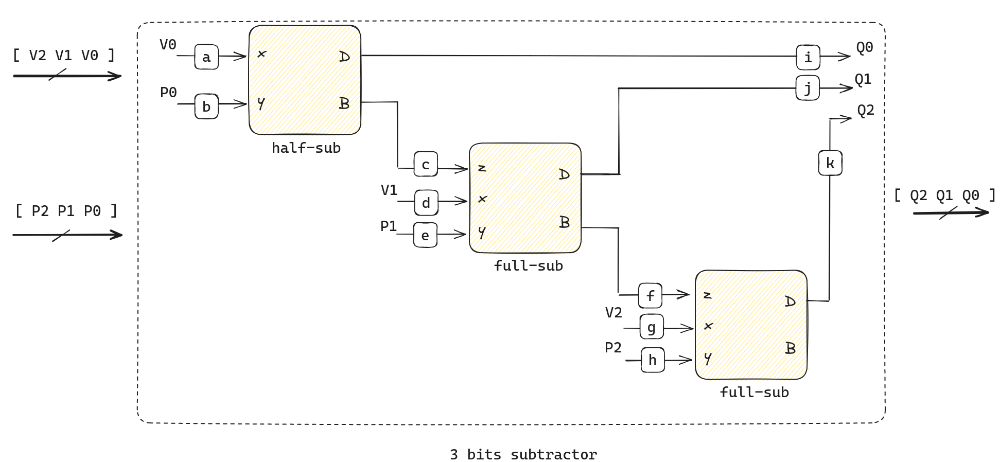

# AV2 - bits e proc

Você possui um total de 1h20 para realizar a avaliação, você pode decidir como usar o seu tempo.

- **Consultar apenas site da disciplinas, códigos de labs e projetos**
- **NÃO PODE USAR O GITHUB COPILOT ou ChatGPT**
- **Trabalhar sozinho**
- **Deixar proctorio aberto**
- **1h20 min**
- **REALIZAR UM COMMIT (A CADA QUESTÃO) E DAR PUSH AO FINALIZAR**

## Começando

Você deve:

1. Usar o codespace na prova
1. não esqueça de dar `commit` e `push` a cada questão

Lembre de executar uma única vez `telemetry auth` no codespace.

> Todas as questões possuem testes, para executar: `pytest -s -k QUESTAO`

Você deve realizar as implementações no arquivo: 

- `coponentes.py`

## Questão 1

| Módulo             | pnts   |
| ------------------ | ------ |
| `exe1(a,b,c,s)`    | 4 (HW) |

Implemente o circuito a seguir em MyHDL


Considere:

```python
- a,b,c : Entradas do tipo bool()
- s: Saída do tipo bool()
```

## Questão 2

| Módulo                                                                       | pnts   |
|------------------------------------------------------------------------------|--------|
| `exe2(L, M, H, LED_verde, LED_amarelo, LED_vermelho, LED_azul, LED_laranja)` | 6 (HW) |

Você é encarregado de desenvolver um sistema de detecção de nível de líquido inflamável em um tanque de uma industria química. O tanque possui três sensores de nível: Baixo (L), Médio (M) e Alto (H). Cada sensor produz um sinal lógico ALTO quando o nível do líquido atinge sua posição.

Você deve desenvolver um circuito em MyHDL que acenda LEDs indicativos com base nas seguintes condições:

1. Se o sensor de nível Baixo (L) estiver ativo e os outros dois sensores estiverem inativos, um `LED verde` deve acender, indicando que o tanque está no nível baixo.
2. Se os sensores de nível Baixo (L) e Médio (M) estiverem ativos, e o sensor Alto (H) estiver inativo, um `LED amarelo` deve acender, indicando que o tanque está no nível médio.
3. Se todos os três sensores estiverem ativos, um `LED vermelho` deve acender, indicando que o tanque está cheio.
4. Se nenhum sensor estiver ativo, `um LED azul` deve acender, indicando que o tanque está vazio.
5. Se sensor Alto (H) estiver ativo e pelo menos um dos outros dois sensores estiver inativo ou se o sensor Médio (M) estiver ativo e o sensor Baixo (L) inativo, um `LED laranja` deve acender, indicando que existe alguma falha nos sensores.


Considere:

```python
- L,M,H : Entradas do tipo bool()
- LED_verde, LED_amarelo, LED_vermelho, LED_azul, LED_laranja: Saídas do tipo bool()
```

## Questão 3

| Arquivo | pnts |
|---------|------|
| myhdl   | 6    |

Um codificador é um circuito que compacta várias entradas binárias em um número menor de saídas. A saída de um codificador de prioridade, que pode ser usado em um sistema embarcado, é a representação binária do índice da linha ativada mais significativa, começando do zero. O codificador de prioridade é usado para controlar pedidos de interrupção.

As entradas do codificador são quatro linhas de interrupção (I3, I2, I1 e I0 ) e ele possui três saídas: P1 e P0, que formam um número binário de 2 bits que indica o número da entrada ativada que possui maior prioridade, e V que indica se há alguma interrupção.

``` 
           -------
   I3 --> |       | -> P1
   I2 --> |       | -> P0
   I1 --> |       | -> V
   I0 --> |       |
           -------
```

A tabela-verdade a seguir mostra o funcionamento do codificador.

| I3 | I2 | I1 | I0 | P1 | P0 | V |
|----|----|----|----|----|----|---|
| 0  | 0  | 0  | 0  | X  | X  | 0 |
| 0  | 0  | 0  | 0  | 0  | 0  | 1 |
| 0  | 0  | 1  | X  | 0  | 1  | 1 |
| 0  | 1  | X  | X  | 1  | 0  | 1 |
| 1  | X  | X  | X  | 1  | 1  | 1 |

### (myhdl) implementação

Implemente as equações que definem as saídas `P0`, `P1` e `V`.

> Módulos:
>   - `exe3` 
>
> Teste:
>   - `pytest -k exe3_p0`
>   - `pytest -k exe3_p1`
>   - `pytest -k exe3_v`
> 
> Entradas e Saídas:
>   - `i3,i2,i1,i0`: Entradas `bool()`
>   - `p1,p0,v`: Saídas `bool()`

## Questão 4 

| Arquivo                                       | pnts    |
|-----------------------------------------------|---------|
| Total:                                        | 16 (HW) |
| (a) (papel) Simulação                         | 6 (HW)  |
| (b) (papel) Equação                           | 2 (HW)  |
| (b) (myhdl) `exe4_half_sub` e `exe4_full_sub` | 2 (HW)  |
| (c) (myhdl) `exe4_sub3`                       | 6 (HW)  |

De forma similar ao `half-adder` e `full-adder`, podemos desenvolver dois componentes chamados de `half-subtractor` e `full-subtractor` que realizam a subtração de números binários.


O `half-subtractor` é um circuito combinacional que subtrai dois bits (`x` - `y`), gerando dois tipos de saída: a diferença (`D`) e o borrow (`B`). O borrow é a saída que indica se foi necessário "emprestar" um bit do próximo dígito mais significativo para realizar a subtração.

O `full-subtractor`, por sua vez, é uma extensão do `half-subtractor`, sendo utilizado para subtrair três bits de entrada: dois bits que são subtraídos (`x`, `y`) e um bit de borrow da subtração anterior (`z`). Assim como o `half-subtractor`, o `full-subtractor` tem duas saídas: a diferença (`D`) e o borrow (`B`).

Ambos, `half-subtractor` e `full-subtractor`, são usados para a construção de unidades aritméticas em sistemas digitais, possibilitando a realização de operações de subtração em números binários de múltiplos bits.

Considere a tabela verdade dos dois componentes:

- `half-subtractor`

| x | y | B | D |
|---|---|---|---|
| 0 | 0 | 0 | 0 |
| 0 | 1 | 1 | 1 |
| 1 | 0 | 0 | 1 |
| 1 | 1 | 0 | 0 |

- `full-subtractor`

| x | y | z | B | D |
|---|---|---|---|---|
| 0 | 0 | 0 | 0 | 0 |
| 0 | 0 | 1 | 1 | 1 |
| 0 | 1 | 0 | 1 | 1 |
| 0 | 1 | 1 | 1 | 0 |
| 1 | 0 | 0 | 0 | 1 |
| 1 | 0 | 1 | 0 | 0 |
| 1 | 1 | 0 | 0 | 0 |
| 1 | 1 | 1 | 1 | 1 |


Notem que podemos interpretar a tabela como valores em complemento de dois! Por exemplo, vamos considerar a situaćão na qual `x=0`, `y=1` e `z=0`, isso significa que temos: `0-1-0= -1`, `-1` em complemento de dois é `11`! Ou seja `B=1` e `D=1`. Outro caso seria o `x=0, y=1, z=1` nesse caso a o resultado seria: `-2 = 0 -1 -1`, e `-2` em complemento de dois é `10`, ou seja: `B=1` e `D=0`.

A seguir um diagrama que usando `half-sub` e `full-sub` implemente um subtrator que recebe como entrada dois vetores: `V` e `P` de trés bits cada (`[V2 V1 V0]`, `[P2 P1 P0]`) e gere um terceiro vetor também de três bits `Q: [Q2 Q1 Q0]`) que é resultado de: `Q = V - P`.



<!--
### a) Circuito 

No papel desenhe um diagrama que usando `half-sub` e `full-sub` implemente um subtrator que recebe como entrada dois vetores: `V` e `P` de trés bits cada (`[V2 V1 V0]`, `[P2 P1 P0]`) e gere um terceiro vetor também de três bits `Q` (`[Q2 Q1 Q0]`) que é resultado de: `Q = V - P`.
-->

### a) (papel) Simulando

Para cada fio (`a,b,c,d,e,...`) do diagrama do subtrator `sub3` apresentado anteriormente, simule o caso para a situaćão `V=3` e `P=-4`. 

### b) (papel) Equações

Encontre as equações reduzidas usando para os componentes `exe4_half_sub` e `exe4_full_sub`.

### c) (myhdl) `half-sub` e `full-sub`

Em MyHDL implemente os componentes `exe4_half_sub` e `exe4_full_sub` a partir das equações encontradas anteriormente.

> Módulos:
>   - `exe4_half_sub` 
>   - `exe4_full_sub`
> 
> Teste: 
>   - `pytest -k exe4_half_sub`
>   - `pytest -k exe4_full_sub`
>
> Entradas e Saídas:
>   - x,y,z: in do tipo bool(0)
>   - q,b: out do tipo bool(0)

### d) (myhdl) `sub3`

Implemente o componente `exe4_sub3` usando o `exe4_half_sub` e `exe4_full_sub`.

> Módulo:
>   - `exe4_sub3` 
> 
> Teste: 
>   - `pytest -k exe4_sub3`
>
> Entradas e Saídas:
>   - v2,v1,v0: in do tipo bool(0)
>   - p2,p1,p0: in do tipo bool(0)
>   - q2,q1,q0: out do tipo bool(0)
